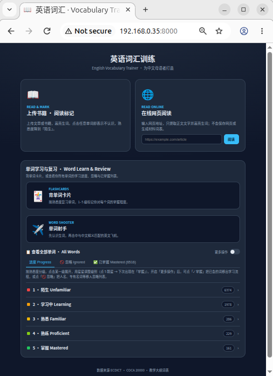

# 英语词汇训练 · English Vocabulary Trainer

A self-hosted vocabulary trainer built for Chinese speakers learning English.
Review words with flashcards, read your own books with unknown words highlighted,
or extract readable text from an online article. Progress is tracked per word on
a 1–5 familiarity scale and persisted locally.

Data comes from [ECDICT](https://github.com/skywind3000/ECDICT) (English→Chinese
dictionary with phonetics, COCA/BNC frequency ranks and exam-syllabus tags) plus
the COCA 20,000 frequency list and graded syllabus word lists.

## Main page



## Features

- **Word roots while reading** — Click a word in Read & Mark to see matching roots
  and affixes beneath its existing dictionary translation.
- **🃏 Flashcards (`/cards`)** — Review words and mark how well you know each one
  with 1–5 buttons. Familiarity levels and an explanation are shown at the bottom.
- **📖 Read & Mark (`/read`)** — Upload an article, book, or common text subtitle file (`.txt .md .html .pdf .epub .srt .vtt .ass` and more);
  known words are highlighted by familiarity. Click any word you don't know to drop it
  to *Unfamiliar*. A **library panel** lists previously uploaded books so you can reopen
  them without re-uploading.
- **🌐 Read Online** — Paste a public webpage URL on the home page. The app extracts
  only its readable text and opens it with the same vocabulary highlighting as an
  uploaded paper, without saving the webpage or creating a material word list.
- **📕 Glossary (`/dictionary`)** — Pre-generate a vocabulary list (phonetic, Chinese
  translation, difficulty, COCA frequency) for an uploaded book, with filtering and CSV export.
- **我的单词 · My Words** — The home page groups your tracked words into five levels
  (1 陌生 → 5 掌握). Expand a level to see the word, Chinese meaning, and clickable stars
  to adjust its level.
- **Auto-populate** — Uploading a book adds all of its words to *My Words*: brand-new
  words start at *Unfamiliar*, while words you've already rated keep their level.
- **LAN access** — The server binds to `0.0.0.0`, so you can open it from a tablet or
  another computer on the same Wi‑Fi.

## Familiarity levels

| Level | Label | 说明 |
| --- | --- | --- |
| 1 | 陌生 Unfamiliar | 不认识 |
| 2 | 学习中 Learning | 见过，还没记住 |
| 3 | 熟悉 Familiar | 大致知道意思 |
| 4 | 熟练 Proficient | 能准确使用 |
| 5 | 掌握 Mastered | 完全掌握 |

## Requirements

- Python ≥ 3.13
- [uv](https://github.com/astral-sh/uv) for dependency management

## Install uv

`uv` manages the Python version and the virtual environment for you.

```bash
# Linux / macOS
curl -LsSf https://astral.sh/uv/install.sh | sh

# Windows (PowerShell)
powershell -c "irm https://astral.sh/uv/install.ps1 | iex"
```

Alternatively: `pipx install uv` or `brew install uv`. After installing, restart
your shell (or `source ~/.bashrc`) so `uv` is on your `PATH`, then verify:

```bash
uv --version
```

## Setup the environment

From the project root, this creates a `.venv` and installs all dependencies from
`pyproject.toml` / `uv.lock`:

```bash
uv sync
```

You don't need to activate the venv manually — always run project commands through
`uv run …` and uv uses the right environment automatically.

## Run the web app

```bash
uv run python main.py
```

The server starts on port `8000` and prints both a local and a LAN URL, e.g.:

- Local:   http://localhost:8000/
- Network: http://192.168.0.28:8000/  (open this on another device on the same Wi‑Fi)

## Access from another device (open the port)

The server already binds to `0.0.0.0`, so it accepts connections from other
devices on your network. If you can't reach the Network URL from a tablet or
another computer, your firewall is likely blocking the port. Allow TCP `8000`:

```bash
# Linux — ufw (Ubuntu/Debian)
sudo ufw allow 8000/tcp

# Linux — firewalld (Fedora/RHEL)
sudo firewall-cmd --add-port=8000/tcp --permanent
sudo firewall-cmd --reload

# macOS: System Settings → Network → Firewall → allow incoming for python
```

```powershell
# Windows (run PowerShell as Administrator)
New-NetFirewallRule -DisplayName "Vocab Trainer 8000" -Direction Inbound -Protocol TCP -LocalPort 8000 -Action Allow
```

Make sure both devices are on the **same Wi‑Fi / LAN**, then browse to the
Network URL printed at startup (e.g. `http://192.168.0.28:8000/`).

To use a different port, edit `port = 8000` in [main.py](main.py) and open that
port instead.


## Pages & API

| Page | Path |
| --- | --- |
| Home / My Words | `/` |
| Flashcards | `/cards` |
| Read & Mark | `/read` |
| Glossary | `/dictionary` |

Key JSON endpoints:

| Method | Endpoint | Purpose |
| --- | --- | --- |
| GET | `/api/meta` | Familiarity + difficulty metadata |
| GET | `/api/study` | Study queue |
| POST | `/api/review` | Record a spaced-repetition response |
| POST | `/api/familiarity` | Set a word's level (1–5) |
| POST | `/api/familiarity/reduce` | Drop a word to *Unfamiliar* |
| GET | `/api/uploads` | List previously uploaded books |
| POST | `/api/reading/prepare` | Upload a book and start reading |
| POST | `/api/reading/open` | Open an already-uploaded book |
| POST | `/api/reading/webpage` | Extract and read a public webpage |
| POST | `/api/dictionary/prepare` | Generate a glossary for a book |
| GET | `/api/mywords/summary` | Per-level word counts |
| GET | `/api/mywords?level=N` | Words at a given level |

## Command-line tools

```bash
# Review / mark words in the terminal
uv run python -m scripts.mark_familiar

# Prepare a reading file (highlight unknown words)
uv run python -m scripts.prepare_reading
```

## Project structure

```
main.py            # Launches the web server on the LAN
vocab/             # Core package
  models.py        # Familiarity enum, graded levels
  loader.py        # Loads ECDICT + word lists
  progress.py      # Thread-safe JSON word-progress store (data/progress.json)
  reading.py       # Shared reading-analysis / rendering logic
  textscan.py      # Text extraction (txt/pdf/epub/html), lemma resolver, ECDICT lookup
  server.py        # FastAPI app: API + page routes
static/            # home / cards / read / dictionary HTML front-ends
scripts/           # CLI tools
resources/         # Dictionary + word-list data (see resources/README.md)
media/uploads/     # Uploaded books
data/progress.json # Your saved familiarity progress (gitignored)
```

## Notes

- Progress is stored in `data/progress.json` (ignored by git).
- Uploaded books are kept under `media/uploads/` and shown in the Read & Mark library.
